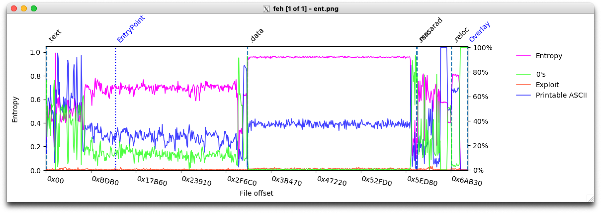

# Cybercrime Analysis
This report is part of a cybercrime analysis project. 
The samples can be downloaded here:
- https://drive.google.com/file/d/1hfG8_nPxQoXszb36uLhYYkTcPTUfa3IK/view?usp=sharing

&ensp;
## Project Context
The incident response team has informed us that an executable file has been found in an ongoing investigation with the following SHA256 hash:

SHA256: __5ffecf27b187bcaec80b45b570631e5bd53672b23dedb4d28d4e3dc6e81214b1__

They have asked for our help in detecting similar binaries, and have requested actionable __IOC__ and __Yara rules__ for this purpose.

&ensp;
## Analysis
### __Relevent elements :__

The following are the six most relevant elements found during the OSINT and malware analysis:
- File entropy: 7.190637 (probably packed).
- 52 security vendors and 4 sandboxes flagged this file as malicious.
- IOCs :
    | Contacted Ip Adresses      | Country |
    | ----------- | ----------- |
    | 185.215.113.29      | SC       |
    | 23.216.147.64   | US        |
    | 239.255.255.250 | - |
- Capabilities :
    | CAPABILITY                                 | NAMESPACE                           |   
    | ------------------------------------------ | ----------------------------------- | 
    | create pipe                                | communication/named-pipe/  create   |   
    | read pipe                                  | communication/named-pipe/read       |
    | write pipe                                 | communication/named-pipe/write      |
    | debug build                                | executable/pe/debug                 |
    | contains PDB path                          | executable/pe/pdb                   |
    | contain a resource (.rsrc) section         | executable/pe/section/rsrc          |
    | manipulate console                         | host-interaction/console            |
    | get common file path                       | host-interaction/file-system        |
    | delete file                                | host-interaction/file-system/delete |
    | move file (2 matches)                      | host-interaction/file-system/move   |
    | read .ini file                             | host-interaction/file-system/read   |
    | get disk information (2 matches)           | host-interaction/hardware/storage   |
    | get disk size                              | host-interaction/hardware/storage   |
    | check mutex                                | host-interaction/mutex              |
    | get hostname                               | host-interaction/os/hostname        |
    | get system information on Windows          | host-interaction/os/info            |
    | get thread local storage value             | host-interaction/process            |
    | allocate RWX memory                        | host-interaction/process/inject     |
    | terminate process (2 matches)              | host-interaction/process/terminate  |
    | terminate thread                           | host-interaction/thread/terminate   |
    | link many functions at runtime (2 matches) | linking/runtime-linking             |

- The file has no signature.
- Contains section with suspicous name (".masarad") and very low virtual size (5 bytes).

&ensp;
### __Interesting and Uncommon Properties :__


The following are the interesting and uncommon properties of the sample:
- Excutes Windows Management Instrument ation
- Defense evasion : Virtualization/Sandbox Evasion
- Collection : Data from Local System
- Contains packed software (overwrites its own PE header and changes PE section rights)
- This sample is part of a virus family called Redline stealer 
- The entropy is concentrated as follows in the file :
    
    We notice that the entropy is very high in the data section but also very high in the __.masarad__ section that contains only 0s in hex editor.

&ensp;
### __Yara rules :__

We've written 4 yara rules to match this sample. 

The 3 yara rules demanded in the project are :
- match1.yara : Specifically matches this sample.
- match2.yara : Reduces the specificity to match similar samples.
- match3.yara : Matches samples using only rich header data.

The matches for __match2.yara__ and __match3.yara__ in the given sample database are:
- 5ffecf27b187bcaec80b45b570631e5bd53672b23dedb4d28d4e3dc6e81214b1
- bbbd0f4f5e6b63549fe49c0cdc9809f9cb70c43a35783519f29301331676fe40
- f89c3828131de9a67cd510e9da867e2ba7de41193773deb7f7e5a14ed86e967f
- 627bc1e4c25d56aa3b16ec1ec8f98a2ff24d9ac18ef32c2dd59d1ea46f00e576
- 8370bc92f5cb661bd26f3bd5abb51f6d56c48acb438ae48aa3351044cd55678f
- 834da6d982eabadc0518f149d8832f421d8d3c2943033ff19c1a84874b88148b
- 234e4cc68a33ec5f9b94a393c85bfc91d17e87bc911713f34e39342d29bf5607
- 9331a8a30aaf5888027bb5540ee57118f23bb2d133de823385cae124491d31d7
- b53a0ad10996f4528bf181dccec2327fbd8b2bd0a9d2095c6bf3b422b25921e8
- 91be0ef6635c6d2430f006acbc090d03338d2eafe921c1cf72fbc8c077cb885b

We've added a last rule __redline.yara__ to match the unpacked sample using relevent behavioral strings used by the Redline Stealer family.

&ensp;

## Parser :
In order to accelerate future responses to such kinds of attacks we've written a python script to check a few properties if the file is a PE:

- Check if this PE is a DLL
- Check if this PE is signed
- Check if this PE has a Rich header
- Extract timestamp from IMAGE_FILE_HEADER
- Check if this PE contains debug directory, if yes, extract the debug type and the timestamp from IMAGE_DEBUG_DIRECTORY.
  
The python script has been provided alongside this report.

The analysis on the file gives us :
```bash
remnux@b0c72fcdd969:~/Project/src$ python3 parser.py ../malware/5ffecf27b187bcaec80b45b570631e5bd53672b23dedb4d28d4e3dc6e81214b1
Pe file analysis
File ../malware/5ffecf27b187bcaec80b45b570631e5bd53672b23dedb4d28d4e3dc6e81214b1 is a PE file.
Is a DLL: False
The file has no signature
The file has a rich header: True
IMAGE_FILE_HEADER Timestamp: 1627653903
The file contains debug directory
Debug Type: 2
Debug Timestamp: 1642414745
```

